## Add Support for CybORG v2.1
Work in progress...

## Emulator Actions
The python script path is hard coded to the virtual env folder path, I will need to ask Dr. Nine how to address this issue.

## Mininet Adapter 

`mininet_api` contains the Mininet API (in python) that is responsible for generating the topology. Any prerequisite configuration such as starting SSH servers automatically once the topology created is done at `custom_topo.py`, the routing rules are configured at `custom_topo.py`

`mininet_adapter` contains the middleware that binds Mininet API and CybORG API.

`MininetAdapter.py` is the main class that runs the `mininet_adapter` logic. Should be placed along with your CybORG object.

`Tests` covered `mininet_adapter` (on going work)

`main.py` is the standalone program that runs the experiment.

```mermaid
classDiagram
    class MininetAdapter {
        -path: str
        -config: ConfigParser
        -topology_manager: YamlTopologyManager
        -command_interface: MininetCommandInterface
        -mapper: CybORGMininetMapper
        -blue_action_translator: BlueActionTranslator
        -red_action_translator: RedActionTranslator
        -results_bundler: ResultsBundler
        -reward_calculator: RewardCalculator
        +set_environment(cyborg: CybORG): None
        +parse_action_string(action_string: str): Tuple[str, str]
        +reset(): None
        +step(action_string: str, agent_type: str): Tuple[Observation, Dict]
        +clean(): None
    }

    class YamlTopologyManager {
        +generate_topology_data(cyborg: CybORG, cyborg_to_mininet_name_map: Dict): None
        +save_topology(file_path: str): None
    }

    class MininetCommandInterface {
        +start_mininet(topology_file: str): str
        +send_command(command: str): str
        +clean(): None
    }

    class CybORGMininetMapper {
        +init_mapping(cyborg: CybORG): None
        +update_mapping(output: str, topology_data: Dict): None
    }

    class BlueActionTranslator {
        +translate(cyborg_action: str, target: str, cyborg_to_mininet_host_map: Dict, mininet_host_to_ip_map: Dict): str
    }

    class RedActionTranslator {
        +translate(cyborg_action: str, target: str, cyborg_to_mininet_host_map: Dict, mininet_host_to_ip_map: Dict): str
    }

    class ResultsBundler {
        +bundle(target: str, cyborg_action: str, isSuccess: bool, mininet_cli_text: str, mapper: CybORGMininetMapper): Observation
    }

    class RewardCalculator {
        +reward(mininet_obs_data: Dict): Dict
    }

    MininetAdapter --> YamlTopologyManager: uses
    MininetAdapter --> MininetCommandInterface: uses
    MininetAdapter --> CybORGMininetMapper: uses
    MininetAdapter --> BlueActionTranslator: uses
    MininetAdapter --> RedActionTranslator: uses
    MininetAdapter --> ResultsBundler: uses
    MininetAdapter --> RewardCalculator: uses
```

## Debugging Note

`Mininet_CybORG_Experiment.ipynb` is a notebook for visualizing the workflow
05/22/2024 - Clean up code & start migrating to v2
